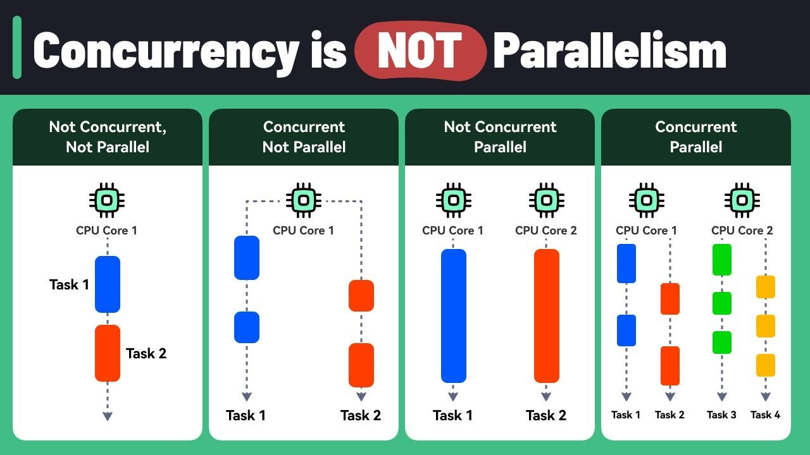
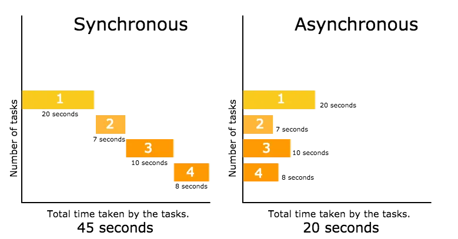
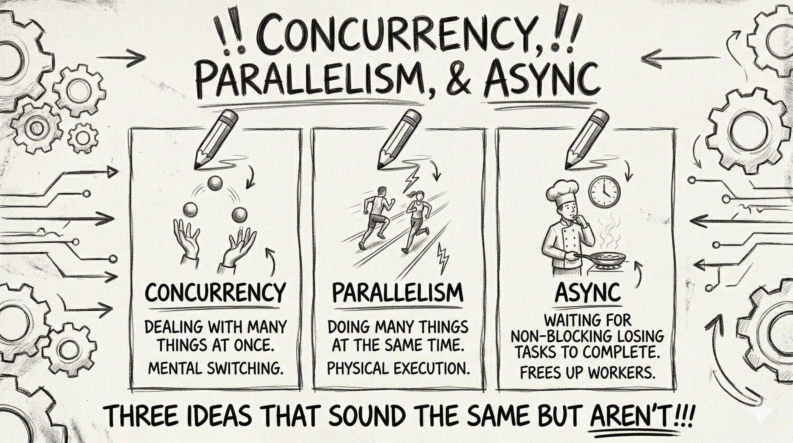

# Async vs Multithreading vs Parallelism vs Concurrency

## Quick Definitions

| Concept                | Short Meaning                                                          |
| ---------------------- | ---------------------------------------------------------------------- |
| **Concurrency**        | Managing multiple tasks at once (not necessarily simultaneously)       |
| **Parallelism**        | Running multiple tasks literally at the same time (multiple CPU cores) |
| **Multithreading**     | Using multiple threads within a process                                |
| **Asynchronous** | Non-blocking execution where tasks progress independently              |

---

## Concurrency

Concurrency is about **structure**, not speed.

You can have concurrency on a single CPU core using context switching.

### Example

```java
ExecutorService executor = Executors.newFixedThreadPool(2);

executor.submit(() -> {
    System.out.println("Task 1");
});

executor.submit(() -> {
    System.out.println("Task 2");
});

executor.shutdown();
```

Here tasks are **managed concurrently**, but may not run at the same exact time.


---

## Parallelism

Parallelism is about **execution** — tasks run at the same time on different cores.

### Example (Java Parallel Stream)

```java
List<Integer> list = List.of(1,2,3,4,5);

list.parallelStream()
    .forEach(i -> System.out.println(Thread.currentThread().getName()));
```

Each element may run on different threads simultaneously.

---



---

## Multithreading

Multithreading = using multiple threads inside one program.

It is a **tool** to achieve concurrency or parallelism.

### Example (Java Threads)

```java
Thread t1 = new Thread(() -> {
    System.out.println("Thread 1");
});

Thread t2 = new Thread(() -> {
    System.out.println("Thread 2");
});

t1.start();
t2.start();
```

Important:

* Threads may run concurrently
* Or in parallel (depends on CPU)


```
Main Process
  ├── Thread 1
  └── Thread 2
```

---

## Asynchronous Programming

Async = **don’t wait, continue execution**.

Main idea: non-blocking behavior.

### Example (CompletableFuture)

```java
CompletableFuture.supplyAsync(() -> {
    return "Result";
}).thenAccept(result -> {
    System.out.println(result);
});

System.out.println("Non-blocking main thread");
```

Output order is NOT guaranteed.


```
Main Thread ---> continues work
         \
          ---> Async Task ---> Callback
```

---

## Key Differences

### Concurrency vs Parallelism

* Concurrency = dealing with many tasks
* Parallelism = executing many tasks at once

> Concurrency is about design
> 
> Parallelism is about hardware usage

---

### Multithreading vs Async

| Multithreading    | Async                    |
| ----------------- | ------------------------ |
| Uses threads      | Uses callbacks/futures   |
| Can block         | Non-blocking             |
| Low-level control | Higher-level abstraction |

---




* You can have async without multithreading (event loop)
* You can have multithreading without async (blocking threads)

---

## Best Way to Remember

* **Concurrency** → "I can handle many things"
* **Parallelism** → "I do many things at the same time"
* **Multithreading** → "I use multiple workers"
* **Async** → "I don’t wait"

---

## When to Use What

| Situation                | Use            |
| ------------------------ | -------------- |
| I/O operations (API, DB) | Async          |
| CPU-heavy tasks          | Parallelism    |
| Background jobs          | Multithreading |
| Complex workflows        | Concurrency    |

---


