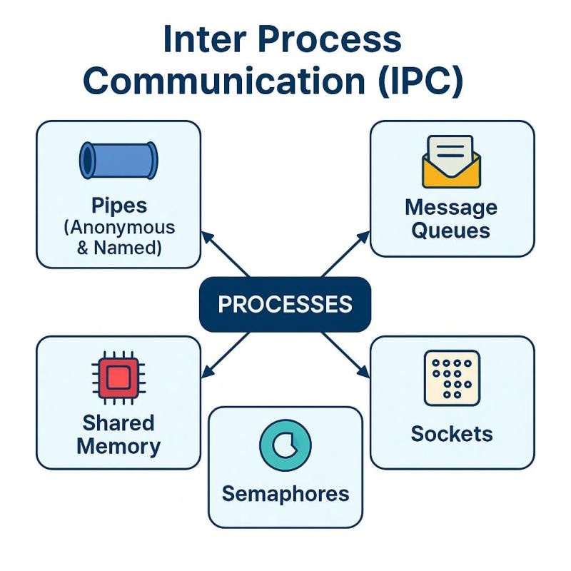

# Module 1 — Application Structure & Runtime Environment

## Why it matters

Every program needs the operating system to start, load libraries, access configuration, and receive environment variables. Understanding this helps explain what happens before your Java application begins to run.

---

# Executable Files (ELF)

Linux programs are usually stored in the **ELF (Executable and Linkable Format)**.

ELF contains:

* executable machine code
* information about required libraries
* symbols (functions and variables)
* metadata for the operating system

You normally don't work with ELF directly, but every compiled Java launcher (`java`) or C program uses this format.

---

# Static vs Dynamic Linking

## Static Linking

The required library code is copied into the executable during compilation.

**Pros**

* standalone executable
* no external library dependencies

**Cons**

* larger file size
* updating a library requires rebuilding the application

---

## Dynamic Linking

Libraries are loaded when the program starts.

Linux uses **shared libraries (`.so`)**, similar to **DLLs** on Windows.

**Pros**

* smaller executables
* many programs can share the same library in memory
* library updates affect multiple applications

**Cons**

* required libraries must exist on the system

Most Linux applications, including Java, use dynamic linking.

---

# Shared Libraries (.so)

A shared library contains code that multiple programs can use.

Examples:

* `libc.so` – standard C library
* `libpthread.so` – threads
* `libjvm.so` – JVM implementation

Instead of copying this code into every application, Linux loads the library when needed.

---

# Dynamic Loader (`ld.so`)

The **dynamic loader** starts before your application.

Its job is to:

* find required shared libraries
* load them into memory
* connect function calls to the correct libraries
* start the application

Without the loader, dynamically linked programs cannot run.

---

# Library Search Path

Linux searches for libraries in standard locations such as:

* `/lib`
* `/usr/lib`
* `/usr/local/lib`

The environment variable **`LD_LIBRARY_PATH`** allows adding extra directories.

Example:

```text
LD_LIBRARY_PATH=/opt/mylibs
```

It is useful for testing custom library versions but is rarely used in production.

---

# LD_PRELOAD

`LD_PRELOAD` tells Linux to load a library **before all others**.

It can:

* replace existing functions
* intercept function calls
* collect logs
* help with debugging and profiling

Example uses:

* logging memory allocation
* measuring performance
* testing applications

---

# Configuration in Linux

Linux has **no central registry** like Windows.

Configuration is usually stored in:

| Location              | Purpose                   |
| --------------------- | ------------------------- |
| `/etc`                | System-wide configuration |
| `~/.config`           | User configuration        |
| Environment variables | Runtime settings          |

This makes configuration simple and transparent.

---

# Environment Variables

Environment variables are key-value pairs available to a running process.

Examples:

```text
JAVA_HOME
PATH
HOME
LANG
```

Applications use them to find executables, configuration, and runtime settings.

---

# Parent and Child Processes

A child process inherits the environment variables of its parent.

Example:

```text
Shell
   ↓
java MyApplication
```

The shell passes its environment to the Java process.

This happens when Linux starts a new program using `execve()`.

---

# Java Connection

Java uses the same operating system mechanisms as any native application.

Examples:

* `java` is an ELF executable.
* The JVM loads shared libraries such as `libjvm.so`.
* `System.getenv()` reads Linux environment variables.
* `JAVA_HOME` and `PATH` help locate the Java installation.
* Native libraries loaded through JNI are also shared libraries (`.so`).

---

# Useful Commands

```bash
ldd java          # Show required shared libraries
env               # Print environment variables
echo $JAVA_HOME   # Show one environment variable
printenv          # Print environment variables
```

---

# What to Remember

* Linux executables use the **ELF** format.
* Most applications use **dynamic linking**.
* Linux shared libraries use the **.so** extension.
* The **dynamic loader (`ld.so`)** loads required libraries before the program starts.
* **`LD_LIBRARY_PATH`** adds extra library search locations.
* **`LD_PRELOAD`** can override library functions.
* Linux stores configuration in files, not in a central registry.
* Environment variables provide runtime configuration.
* Child processes inherit environment variables from their parent.
* Java relies on all of these Linux mechanisms under the hood.


---

# Module 2 — OS Resources & Handles (File Descriptors)

## Why it matters

Every Linux program works with operating system resources such as files, sockets, pipes, and devices. Linux accesses all of them through **file descriptors (fd)**.

Understanding file descriptors helps explain how Java reads files, opens network connections, and communicates with the operating system.

---

# Everything is a File

One of the main Unix ideas is:

> **Everything is a file.**

Many different resources use the same interface:

* Regular files
* Directories
* Network sockets
* Pipes
* Devices (disk, keyboard, etc.)
* Some entries in `/proc`

This allows applications to use the same system calls (`open`, `read`, `write`, `close`) for many resource types.

---

# What is a File Descriptor?

A **file descriptor (fd)** is a small integer that identifies an opened resource.

Example:

```text
0 → Standard Input (stdin)
1 → Standard Output (stdout)
2 → Standard Error (stderr)
3 → Open file
4 → Network socket
```

The application works with the file descriptor instead of accessing the resource directly.

---

# How It Works

When a program opens a file:

1. The kernel opens the resource.
2. The kernel creates a file descriptor.
3. The program receives the descriptor number.
4. All future operations use this number.

When the program finishes, it closes the descriptor.

---

# File Descriptor Table

Each process has its own **file descriptor table**.

This means:

* two processes can both have file descriptor **3**
* they may refer to completely different resources

The descriptor number is only meaningful inside its own process.

---

# Inodes

Linux stores information about every file in an **inode**.

An inode contains:

* file owner
* permissions
* file size
* timestamps
* location of the file data

The file descriptor eventually points to this information through the kernel.

You do not need to know the internal implementation—just remember that an inode represents the actual file.

---

# File Descriptor Inheritance

When a process creates another process (`fork()`), the child inherits the parent's open file descriptors.

This allows parent and child processes to use the same files or sockets.

The **close-on-exec** flag tells Linux to automatically close a descriptor when another program is started with `exec()`.

---

# Windows HANDLE vs Linux File Descriptor

Both represent an operating system resource.

| Windows                    | Linux                                   |
| -------------------------- | --------------------------------------- |
| HANDLE                     | File Descriptor                         |
| Opaque object              | Small integer                           |
| Used for many OS resources | Used for files, sockets, pipes, devices |

The idea is the same: applications do not access hardware directly—they use a kernel-managed identifier.

---

# Java Connection

Java uses file descriptors behind the scenes.

Examples:

* `FileInputStream` opens a file descriptor.
* `Socket` uses a file descriptor for network communication.
* Java NIO channels also use file descriptors.
* When a stream is closed, Java closes the underlying file descriptor.

Although Java hides them, every file or socket operation eventually becomes Linux system calls.

---

# Useful Commands

```bash
lsof -p <pid>      # Show open file descriptors of a process
ls -l /proc/<pid>/fd   # List all file descriptors
```

---

# What to Remember

* Linux follows the idea **"Everything is a file."**
* A **file descriptor (fd)** is a small integer that identifies an opened resource.
* Every process has its own file descriptor table.
* File descriptors are used for files, sockets, pipes, and devices.
* Open file descriptors can be inherited by child processes.
* **close-on-exec** prevents descriptor inheritance after `exec()`.
* Windows **HANDLE** and Linux **file descriptor** solve a similar problem in different ways.
* Java works with file descriptors internally whenever it reads files or communicates over the network.


---

# Module 3 — Event Loops, Messages & IPC

## Why it matters

Programs often need to wait for user input, network requests, or messages from other programs. Instead of constantly checking every resource, Linux can notify the application when something happens.

This makes applications faster and more efficient.

---

# Event Loop

An **event loop** is a loop that waits for events and processes them one by one.

Typical events:

* A client connects
* Data arrives from a socket
* A user presses a key
* A timer expires

Instead of creating one thread for every connection, one thread can handle many events.

Imagine a server with **10,000 clients connected at the same time**.

One approach is to create **10,000 threads** — one for each client.

A more efficient approach is to run a single loop:

```text
while (true) {
    wait for an event

    if (an event occurs)
        process it
}
```
---

# select(), poll() and epoll()

Linux provides several ways to wait for events.

### select()

* Old interface
* Works for a small number of connections

### poll()

* More flexible than `select()`
* Better scalability

### epoll()

* Modern Linux solution
* Designed for thousands of connections
* Used by high-performance servers

Today, **epoll** is the preferred solution on Linux.

---

# Signals

A **signal** is a small asynchronous notification sent to a process.

Common examples:

* `SIGINT` – stop the program (Ctrl+C)
* `SIGTERM` – request graceful shutdown
* `SIGKILL` – force the process to stop

Signals let the operating system or another process notify an application that something happened.

---

# IPC (Inter-Process Communication)

IPC means **communication between processes**.

Common IPC methods:

* **Pipes** – simple communication between related processes
* **Message Queues** – send structured messages
* **Unix Domain Sockets** – communication between processes on the same machine
* **D-Bus** – communication between Linux desktop applications and system services


Each method is designed for different use cases.

---

# Java Connection

Java uses the same operating system mechanisms.

Examples:

* Java NIO `Selector` uses **epoll** on Linux.
* Every `Socket` is a Linux socket.
* Java applications receive signals such as `SIGTERM` when they are stopped.
* Frameworks like Spring Boot handle these signals to perform graceful shutdown.

Although Java hides the implementation, Linux handles the actual event waiting.

---

# Useful Commands

```bash
kill -SIGTERM <pid>   # Send a termination signal
kill -SIGKILL <pid>   # Force a process to stop
kill -SIGUSR1 <pid>   # Send a custom user signal
ps -ef                # List running processes
```

---

# What to Remember

* An **event loop** waits for events instead of constantly checking resources.
* Linux provides **select()**, **poll()**, and **epoll()** for event-driven I/O.
* **epoll** is the modern and most scalable solution.
* **Signals** are asynchronous notifications sent to a process.
* **IPC** allows processes to communicate with each other.
* Common IPC methods are pipes, Unix domain sockets, message queues, and D-Bus.
* Java NIO `Selector` uses **epoll** on Linux.
* Java applications receive Linux signals such as `SIGTERM` during shutdown.

---

# Module 4 — Process & Thread Management

## Why it matters

Every running application is a **process**. A process can contain one or more **threads** that execute tasks concurrently.

Understanding processes and threads helps explain how Java applications run and how the operating system schedules work.

---

# Process

A **process** is a running instance of a program.

Each process has its own:

* memory
* file descriptors
* environment variables
* process ID (PID)

Processes are isolated from each other, which improves stability and security.

---

# Thread

A **thread** is the smallest unit of execution inside a process.

Threads in the same process share:

* memory
* open files
* resources

Each thread executes independently, allowing multiple tasks to run at the same time.

---

# fork(), exec() and clone()

Linux uses different system calls to create processes and threads.

* **fork()** – creates a new process by copying the current one.
* **exec()** – replaces the current process with a new program.
* **clone()** – creates threads or processes that can share resources.

Java threads are implemented using Linux threads created with `clone()`.

---

# Synchronization

When multiple threads access shared data, they must be synchronized.

Common synchronization primitives:

* **Mutex** – only one thread can enter a critical section.
* **Semaphore** – limits how many threads can access a resource.
* **Condition Variable** – allows threads to wait for a specific event.

Without synchronization, applications may produce incorrect results.

---

# Scheduler

The **scheduler** decides which thread runs on the CPU.

Linux uses the **Completely Fair Scheduler (CFS)**.

Its goal is to give CPU time fairly to all running processes.

---

# Process Priority

Linux allows changing process priority with **nice** values.

* Lower nice value → higher priority
* Higher nice value → lower priority

Higher-priority processes usually receive more CPU time.

---

# Race Conditions and Deadlocks

### Race Condition

A race condition happens when multiple threads modify shared data at the same time without proper synchronization.

The result becomes unpredictable.

---

### Deadlock

A deadlock happens when two or more threads wait for each other forever.

None of them can continue.

Applications should avoid deadlocks by designing synchronization carefully.

---

# Java Connection

Java uses the same operating system mechanisms.

Examples:

* Every Java application is a Linux process.
* Every Java `Thread` is an operating system thread.
* `synchronized` and `ReentrantLock` use OS synchronization primitives.
* The Linux scheduler decides when Java threads run on the CPU.

The JVM manages threads, but Linux ultimately schedules them.

---

# Useful Commands

```bash
ps -ef              # List running processes
top                 # Monitor CPU and memory usage
htop                # Interactive process viewer
nice                # Start a process with a different priority
renice              # Change priority of a running process
```

---

# What to Remember

* A **process** is a running program.
* A process can contain multiple **threads**.
* Threads share memory and resources inside a process.
* `fork()` creates a new process.
* `exec()` starts a new program inside a process.
* `clone()` is used to create Linux threads.
* Synchronization prevents race conditions.
* The Linux **CFS scheduler** decides which thread uses the CPU.
* **nice** values control process priority.
* Every Java application is a process, and every Java thread is scheduled by the Linux kernel.

---


# Module 5 — I/O: Access, Sharing & Concurrency Control

## Why it matters

Applications constantly read and write files. The operating system controls **how files are opened, who can access them, and how multiple processes safely work with the same file**.

Understanding these concepts helps explain how Java performs file I/O and prevents data corruption.

---

# Opening Files

Before reading or writing a file, a program must open it.

When opening a file, Linux uses different **flags** to specify how the file should be accessed.

Common flags:

| Flag         | Meaning                                  |
| ------------ | ---------------------------------------- |
| `O_RDONLY`   | Open for reading only                    |
| `O_CREAT`    | Create the file if it does not exist     |
| `O_APPEND`   | Always write to the end of the file      |
| `O_NONBLOCK` | Do not wait if the operation would block |

These flags define the behavior of file operations.

---

# File Locking

Sometimes multiple processes need to access the same file.

To avoid conflicts, Linux supports **file locking**.

A lock temporarily reserves a file (or part of it) so that other processes cannot modify it at the same time.

This helps prevent data corruption.

---

# Blocking vs Non-Blocking I/O

### Blocking I/O

The program waits until the operation completes.

Example:

```text
Read file
      ↓
Wait...
      ↓
Continue execution
```

Simple to use, but the thread cannot do other work while waiting.

---

### Non-Blocking I/O

The operation returns immediately.

If the data is not ready, the program can continue doing other work and check again later.

This approach is commonly used in high-performance servers.

---

# Buffered I/O

Linux uses a **page cache** to improve performance.

Instead of reading from or writing directly to the disk every time, data is often stored temporarily in memory.

Benefits:

* fewer disk operations
* faster file access
* better overall performance

Applications usually do not need to manage the cache themselves.

---

# Concurrent File Access

Multiple processes can open the same file at the same time.

This is usually safe for reading.

Writing requires more care.

Without locking or proper coordination, processes may overwrite each other's data.

---

# Java Connection

Java uses the same Linux mechanisms.

Examples:

* `FileInputStream` opens files using Linux system calls.
* `FileChannel` provides efficient file operations.
* `FileLock` uses Linux file locking.
* Java NIO supports non-blocking I/O for scalable applications.

The JVM hides these details, but the operating system performs the actual work.

---

# Useful Commands

```bash
lsof <file>          # Show which processes have the file open
cat /proc/locks      # Display active file locks
```

---

# Module 6 — Memory Management

## Why it matters

Memory is one of the most important resources managed by the operating system. Linux controls how memory is allocated, protected, and shared between processes.

Understanding memory management helps explain how the JVM uses memory and why Java applications sometimes run out of memory.

---

# Virtual Memory

Each process has its own **virtual address space**.

This means:

* processes cannot directly access each other's memory
* the operating system isolates applications
* programs behave as if they own all available memory

The kernel maps virtual memory to physical RAM.

---

# Heap and Memory Allocation

Applications request memory from the operating system when needed.

Linux mainly uses two mechanisms:

* **brk()** – grows the process heap
* **mmap()** – maps memory into the process address space

Modern applications, including the JVM, primarily use **mmap()**.

---

# Memory Allocation

When a program needs memory, it requests it from the operating system.

When the memory is no longer needed, it should be released.

If memory is not released correctly, the application wastes RAM.

---

# Copy-on-Write (CoW)

When a process is created with `fork()`, Linux initially **shares memory pages** between the parent and child.

A page is copied **only when one of the processes modifies it**.

This technique is called **Copy-on-Write (CoW)**.

It saves both memory and CPU time.

---

# Demand Paging

Linux does not load all memory immediately.

Memory pages are loaded **only when they are actually accessed**.

This reduces startup time and improves memory efficiency.

---

# Swap

If physical RAM becomes full, Linux can move inactive memory pages to disk.

This area is called **swap**.

Swap allows applications to continue running but is much slower than RAM.

---

# OOM Killer

If the system completely runs out of memory, Linux may terminate one or more processes.

This mechanism is called the **Out-Of-Memory (OOM) Killer**.

Its goal is to free memory and keep the system responsive.

---

# Java Connection

The JVM also relies on Linux memory management.

Examples:

* The Java heap is allocated using Linux memory mechanisms (mainly `mmap()`).
* `-Xmx` limits only the **Java heap**.
* A Java process also uses memory for:

    * thread stacks
    * metaspace
    * native libraries
    * direct buffers

Therefore, the total memory used by a Java process can be **greater than `-Xmx`**.

---

# Useful Commands

```bash
free -h            # Show memory usage
top                # Monitor memory usage
cat /proc/meminfo  # Display memory information
```

---

